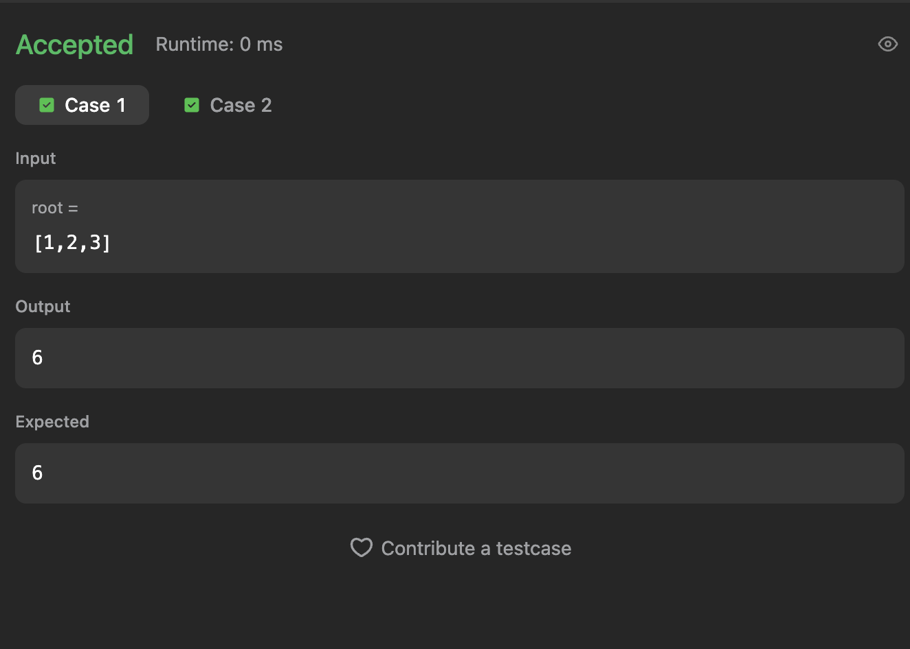
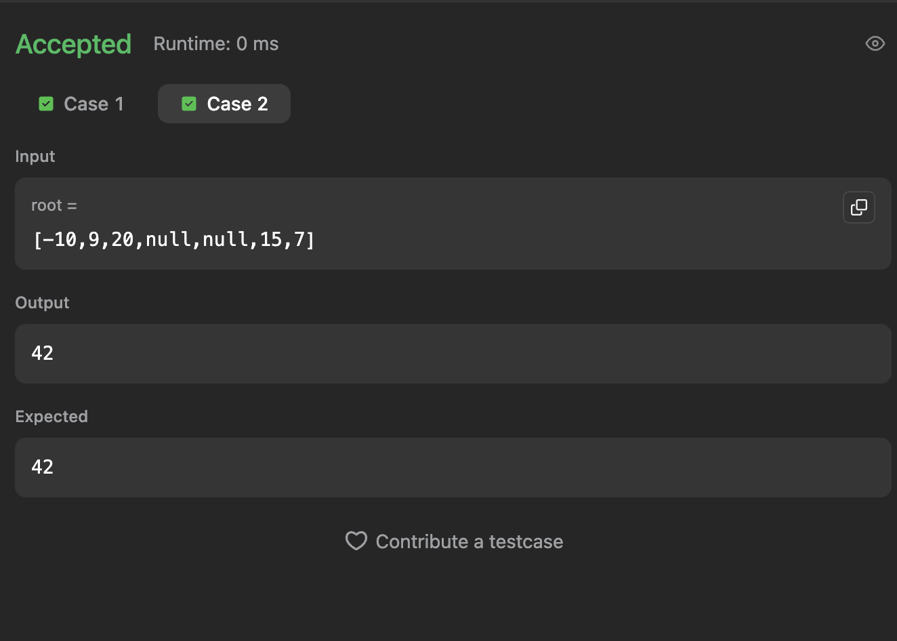
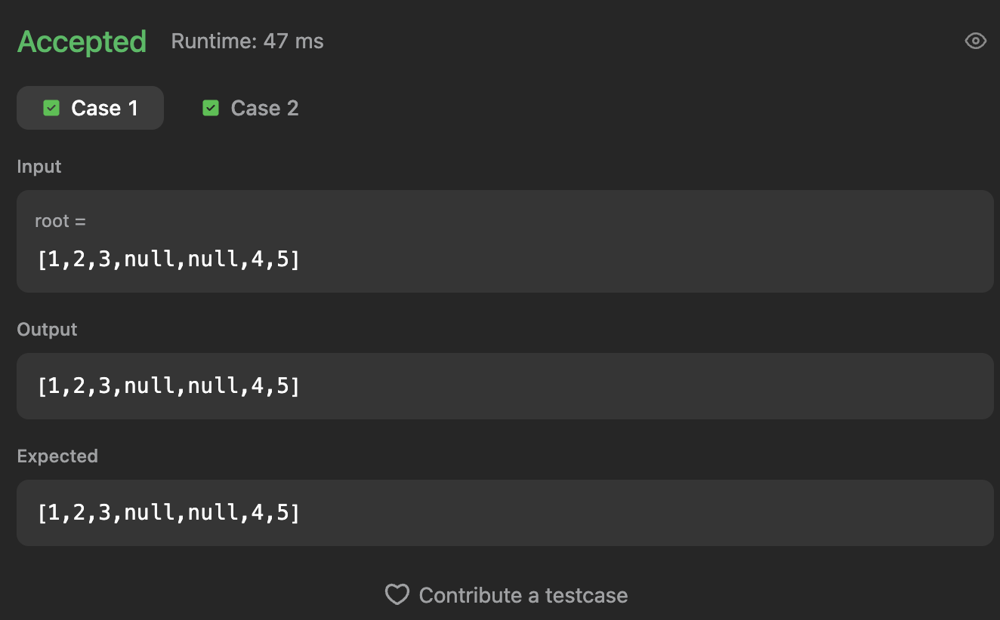
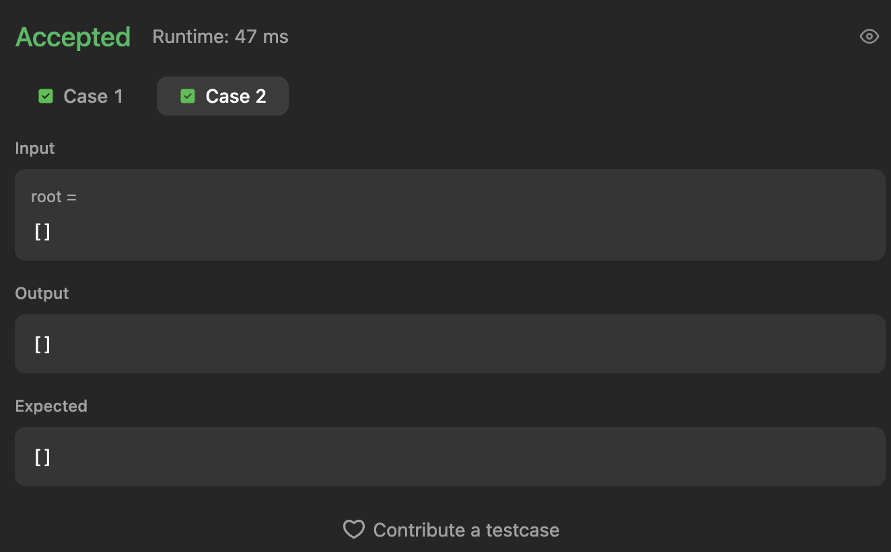

# ArvoreBalanceada_LC 🌳

## Alunos

| Matrícula  | Nome              |
| ---------- | ----------------- |
| 21/1061832 | Harleny Angéllica |
| 21/1061331 | Alana Gabriele    |

---

## Sobre

Este projeto tem como objetivo resolver questões do LeetCode sobre Árvores AVL utilizando a linguagem de programação Python e TypeScript. Abaixo, estão listadas as questões selecionadas, com seus respectivos níveis de dificuldade e vídeos explicativos da resolução.

### Questões

| Nome                                                                                                                                             | Nível   | Vídeo                                 |
| ------------------------------------------------------------------------------------------------------------------------------------------------ | ------- | ------------------------------------- |
| [1382. Balance a Binary Search Tree](https://leetcode.com/problems/balance-a-binary-search-tree/description/?envType=problem-list-v2&envId=tree) | Média   | [Vídeo]()                             |
| [124. Binary Tree Maximum Path Sum](https://leetcode.com/problems/binary-tree-maximum-path-sum/)                                                 | Difícil | [Vídeo](https://youtu.be/Edp1VZ-RNf8) |
| [297. Serialize and Deserialize Binary Tree](https://leetcode.com/problems/serialize-and-deserialize-binary-tree/)                               | Difícil | [Vídeo](https://youtu.be/Edp1VZ-RNf8) |
| [315. Count of Smaller Numbers After Self](https://leetcode.com/problems/count-of-smaller-numbers-after-self/description/)                       | Difícil | [Vídeo]()                             |

---

### Dependências do projeto

- Python 3.10+ instalado e acessível via `python3`.
- Node.js 18+ (LTS) e `npm` para executar soluções em TypeScript.
- TypeScript (`tsc`) e, opcionalmente, `ts-node` para rodar `.ts` sem compilar.

### Como executar o projeto

```
# Python
python3 caminho/para/arquivo.py

# TypeScript (com ts-node)
ts-node caminho/para/arquivo.ts

# TypeScript (compilar e rodar com Node)
tsc caminho/para/arquivo.ts --target ES2020 --module commonjs
node caminho/para/arquivo.js
```

## Capturas de Tela

### Questão 1382. Balance a Binary Search Tree

#### Exemplo 1


#### Exemplo 2


---

## Capturas de tela

### Questão 124. Binary Tree Maximum Path Sum

#### Exemplo 1



#### Exemplo 2



### Questão 297. Serialize and Deserialize Binary Tree

#### Exemplo 1



#### Exemplo 2


